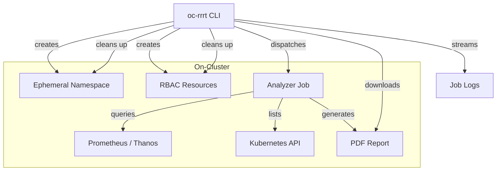

# Resource Rightsizing Reporting Tool (RRRT)

Welcome to the RRRT tutorial! This guide walks you through the architecture and internals of a Go-based CLI tool that analyzes resource allocation on OpenShift clusters and generates PDF reports with rightsizing recommendations for both virtual machines (KubeVirt) and container workloads (Deployments and StatefulSets).

## What Does RRRT Do?

RRRT answers a common question for platform teams: *"Are our workloads using the resources they're allocated?"*

It connects to the cluster's Prometheus instance, collects CPU and memory utilization metrics over a configurable lookback window, applies percentile-based statistical analysis, and produces a professional PDF report. The report includes:

- An executive summary with a donut chart showing the distribution of right-sized, oversized, and undersized resources
- Per-resource detail cards with CPU and memory utilization time-series charts
- Rightsizing recommendations with justifications backed by P95 utilization data
- Owner attribution resolved from resource and namespace labels
- Direct links to each resource in the OpenShift Console

## Architecture Overview

RRRT uses a **thin-client / fat-job** architecture. The CLI plugin (`oc rrrt report`) runs on the user's workstation and dispatches a Kubernetes Job on-cluster. The Job container does all the heavy lifting — querying Prometheus, crunching numbers, and generating the PDF. This design means the analysis runs close to the data (inside the cluster network) and the user's machine only needs `oc` access.



## Technical Stack

| Technology | Purpose |
|---|---|
| **Go 1.26** | Primary language |
| **cobra** | CLI framework for `oc-rrrt` |
| **client-go** | Kubernetes API access (typed and unstructured) |
| **controller-runtime** | High-level Kubernetes client for the analyzer |
| **go-pdf/fpdf** | PDF generation |
| **go-chart/v2** | Line charts and donut charts for the report |
| **Prometheus HTTP API** | Metric collection via PromQL queries |

## Project Layout

```
cmd/
  oc-rrrt/       CLI entrypoint (thin client)
  analyzer/      Analyzer entrypoint (runs inside the Job)
internal/
  cli/           CLI orchestration: RBAC, Job, log streaming, cleanup
  collector/     Prometheus client, PromQL queries, VM and container collectors
  calculator/    Percentile computation and rightsizing analysis
  owner/         Owner resolution from resource/namespace labels
  pdf/           PDF report generation with charts and tables
  types/         Shared domain types and constants
```

## What You'll Learn

- How the thin-client / fat-job pattern works for on-cluster analysis tools
- How to query Prometheus from Go using the HTTP API with TLS and bearer token auth
- How to work with KubeVirt VMs using the unstructured Kubernetes client
- How the P95-based rightsizing calculator determines downsize vs. upsize recommendations
- How to generate multi-page PDF reports with embedded charts in Go
- How RBAC, ephemeral namespaces, and signal-safe cleanup work together
- How owner attribution is resolved from Kubernetes labels

## Prerequisites

- Basic Go knowledge (functions, structs, interfaces, error handling)
- Familiarity with Kubernetes concepts (namespaces, Pods, Jobs, RBAC)
- Understanding of what Prometheus does (metrics collection and PromQL queries)
- Access to an OpenShift cluster is helpful for running RRRT, but not required to understand the code

Let's dive in! We'll start with the shared types and constants that form the foundation of the project.
